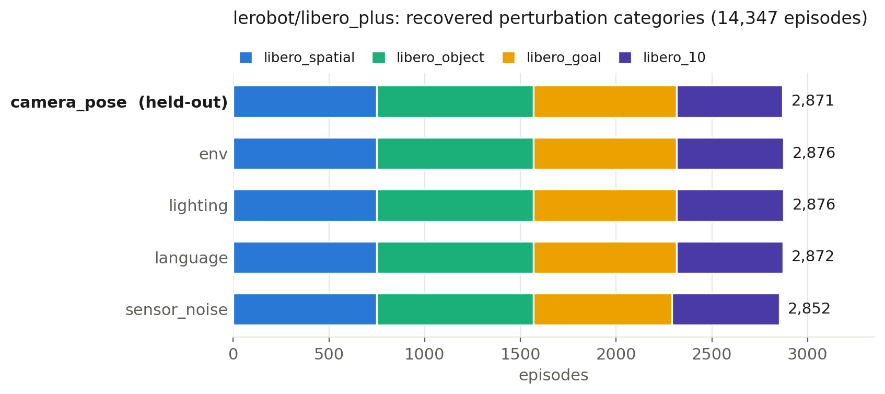
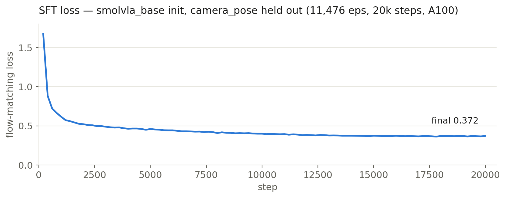

# SmolVLA_RL — Low-Budget Post-Training of a Flow-Matching VLA

[](https://doi.org/10.5281/zenodo.21585106)
[](LICENSE)

An experimental repository that post-trains SmolVLA (LeRobot) on LIBERO-Plus with
**Flow-SDE GRPO** and compares it against alternative methods consuming the same
rollouts (RS-SFT / flow-DPO) under a **paired evaluation**. The entire pipeline
runs on a single Colab GPU (1 run ≈ 15.5 GPU-hours).

**The original research question** was whether RL could recover the camera-viewpoint
perturbation weakness (the 95%→30% drop reported by LIBERO-Plus), but **that is not
what we were actually able to measure**. We had assumed that varying the initial
conditions alone on already-trained tasks was a comparison a single-GPU budget could
support with a paired test; auditing the benchmark destroyed that assumption (the
initial state cannot be chosen with the reset seed, and eval A's initial conditions
turned out to be the training ones). The confirmatory result is therefore **a null on
a preregistered unseen-task evaluation**. The perturbation axis remains a small,
exploratory probe. This README states that gap explicitly rather than glossing it.

> **The manuscript is not part of this repository.** It is unfinished, and the
> repository and the paper are separate deliverables released on their own
> schedules. What *is* published here is the code, the
> [preregistration](data/eval/PREREGISTRATION_unseen_task_eval.md) and the raw
> evaluation JSON — a preregistration only functions as evidence if it is public,
> and the numbers below are all reproducible from the files in `data/eval/` with
> the scripts in `analysis/`. See [Manuscript](#manuscript) below.

## Main results (all real data)

**The short version**: once the evaluation is built so that the confounds are gone,
no method is separated from the SFT baseline. What this study delivers is not a
winning method but **an audit and a null**.

### The confirmatory result — preregistered unseen-task evaluation (GRPO vs SFT)

The design, the primary statistic and the decision rules were committed **before a
single episode was run**
([`data/eval/PREREGISTRATION_unseen_task_eval.md`](data/eval/PREREGISTRATION_unseen_task_eval.md)).
GRPO (run8 final) is contrasted with **the SFT checkpoint it was initialized from**.
On tasks that were never trained on, initial-state contamination cannot arise by
construction. 48 tasks were drawn; 2 errored for **both** arms and were dropped under
the prespecified rule, leaving **46 effective tasks × 3 initial states = 138 paired
episodes per arm**.

| Arm | Successes | Success rate (task-bootstrap 95% CI) |
|---|---|---|
| SFT (the initialization) | 19/138 | 13.8% [7.3, 21.7] |
| GRPO (run8) | 20/138 | 14.5% [8.0, 21.7] |

- **Primary statistic** (preregistered): mean per-task success-rate difference
  (GRPO − SFT) = **+0.72 pp**, 95% task-clustered bootstrap CI
  **[−5.07, +6.52] pp** (20000 resamples). **The interval includes zero.**
- **Secondary**: exact McNemar on discordant pairs (8 GRPO wins / 7 SFT wins) →
  **p = 1.0**.
- By the prespecified decision rule this is **NOT ESTABLISHED**. We report the
  interval and do not re-slice, add arms, add pools, or add episodes and re-test.
- A null is **not** proof of equivalence or inferiority. The interval rules out an
  effect as large as the exploratory probe suggested, and nothing more (as recorded
  in advance, at half the pilot effect no design affordable on a T4 has the power to
  resolve it).

Source of the numbers:
[`data/eval/eval_unseen_prereg_result.json`](data/eval/eval_unseen_prereg_result.json).
**You do not have to take that file's word for it.** The two raw per-arm outputs
`src/eval_heldout.py` produced are committed as
[`data/eval/raw/sft_result.json`](data/eval/raw/sft_result.json) and
[`data/eval/raw/grpo_result.json`](data/eval/raw/grpo_result.json), and every
number above — including the secondary endpoint, which needs the per-episode
records rather than per-task counts — is recomputed from them by:

```bash
python analysis/analyze_unseen_prereg.py data/eval/raw/sft_result.json data/eval/raw/grpo_result.json
```

That is the difference between a repository that reports a result and one that
lets you check it.

### eval A (7 trained tasks, 105 episodes per method) — confounded, not the headline

| Method | Success rate (task-bootstrap 95% CI) | Net paired wins vs SFT (episodes) | Mean per-task difference vs SFT, pp (task-clustered CI) | McNemar p |
|---|---|---|---|---|
| SFT (baseline) | 28.6% [15.2, 41.9] | — | — | — |
| RS-SFT | 42.9% [24.8, 61.9] | +15 | +14.3 [+2.9, +28.6] | 0.003 |
| flow-DPO | 35.2% [22.9, 48.6] | +7 | +6.7 [−3.8, +16.2] | 0.230 |
| GRPO (ours) | 31.4% [17.1, 44.8] | +3 | +2.9 [−1.9, +7.6] | 0.648 |

Column 3 is a **count of episodes** (method-wins minus SFT-wins); column 4 is in
**percentage points**. They are the same contrast in different units: over the 105
paired episodes (7 tasks x 15), +15 net episodes is +14.3 pp. These used to share one
cell as `+15 [+2.9, +28.6] pp`, which made the count look like a percentage.

**Do not read this table as a ranking of methods.** Auditing the benchmark while
writing the paper surfaced two confounds:

1. **The initial states were not held out — they were the training ones.** In
   LIBERO-Plus the initial state cannot be chosen with the reset seed:
   `LiberoEnv.reset()` applies the seed and then overwrites the state with
   `set_init_state(init_states[init_state_id % N])`, where `init_state_id` starts
   from the sub-env's `episode_index` and advances by `n_envs` on **every reset**.
   The states eval A used are a **subset** of those rollout collection visited. This
   matters **asymmetrically**: RS-SFT behaviour-clones successful trajectories from
   exactly those states, and flow-DPO's preference pairs come from the same
   collection. So eval A is not merely underpowered — it is **biased in favour of
   RS-SFT and flow-DPO**, and adding episodes would not remove that bias. Two of the
   8 training tasks (1817, 1955) even have `len(init_states) = 1`, so collection,
   GRPO training and every eval-A episode on them started from the identical state.
2. **The pairing was broken.** A terminated episode triggers two resets
   (`LiberoEnv.step`'s internal reset plus gymnasium's NEXT_STEP autoreset), so from
   the second wave onward the initial state depended on **the arm's own success
   pattern**. Only **56 episodes per arm** are genuinely paired (7 of 15 per task are
   not). On that subset RS-SFT leads by +12.5 pp but the contrast is inconclusive
   (exact McNemar p = 0.092, task-clustered CI [−3.6, +30.4] pp).

**An offset cannot repair this.** Because a successful episode causes two resets,
collection does not touch a contiguous block like `{0..31}` but a scattered set
reaching as high as 79, which then wraps via `% N`. At the real N = 50 that blocks 32
of the 50 states, and **no free window of the required width 15 exists** (enumerate
with `src/init_state_coverage.py`). The corrected study therefore uses **unseen tasks**
and a **per-wave vector-env rebuild** instead of an offset. Note also that
`N = len(init_states)` is bimodal: 385 tasks have 1, 1641 have 50, nothing in between.

### What the study does deliver

- GRPO is **not short of data but short of updates**: it uses 5× the rollouts
  (1280 vs 256 episodes) while taking only 20 optimizer steps (RS-SFT takes 400).
  What this budget establishes is not which learning rule is better, but the
  **exchange rate** between the two.
- **Diagnostic contributions**: (1) the length-normalization trap (explained via
  the GSPO identity), (2) chunk-weighting bias and the episode-equal correction
  (run7→run8), (3) staged reward + funnel diagnostics, (3') **a no-op wrapper that
  passes its own equivalence test** — in-chunk render skipping measured x0.99 (no
  effect) and was explained as "EGL rendering is GPU-side"; in fact, under
  gymnasium 1.x the wrapper's camera probe does not resolve and `set_render_skip`
  degrades to a no-op, which explains both the identical observations and the x0.99,
  so the original explanation is withdrawn (both runs use `render_skip: false`, so no
  result depends on it), (4) an upstream issue on LIBERO-Plus initial-state selection
  ([huggingface/lerobot#4152](https://github.com/huggingface/lerobot/issues/4152),
  reproduction script `scripts/repro_libero_init_state.py`), (5) an honest null
  result.

Details and caveats for each of these are in the sections below; the manuscript
that discusses them at length is not part of this repository (see
[Manuscript](#manuscript)).

## Key deliverables

| Deliverable | Status |
|---|---|
| [`data/episode_categories.csv`](data/episode_categories.csv) — recovery of the per-episode perturbation categories missing from the public dataset | ✅ all 14,347 episodes validated |
| Leakage-safe camera-viewpoint held-out split (train 11,476 / heldout 2,871) | ✅ |
| Flow-SDE GRPO port to SmolVLA (`src/grpo/`, with π0/π0.5 adapters) | ✅ unit-tested; run7 and run8 both completed 20 iterations |
| Colab end-to-end pipeline (setup → SFT → evaluation) | ✅ verified on real A100/T4 |
| A [preregistered](data/eval/PREREGISTRATION_unseen_task_eval.md) unseen-task evaluation (design committed before running) and its [raw result](data/eval/eval_unseen_prereg_result.json) | ✅ executed; the result is a null (NOT ESTABLISHED) |
| Minimal reproduction and upstream report of LIBERO-Plus initial states not being selectable by the reset seed ([lerobot#4152](https://github.com/huggingface/lerobot/issues/4152)) | ✅ filed |

## Dataset: recovering the perturbation categories

The public metadata of `lerobot/libero_plus` (14,347 episodes) carries only 40
natural-language tasks, and **each episode's perturbation category is lost**.
Since the same language task appears in multiple categories, a held-out split
cannot be built by language matching.

This repository established that the RLDS version the dataset was converted from
([`Sylvest/libero_plus_rlds`](https://huggingface.co/datasets/Sylvest/libero_plus_rlds), 75 GB)
preserves episode order, and recovered the categories from the
`episode_metadata/file_path` retained on the RLDS side
(`pro_data/<category>/<suite>/<task>_demo.hdf5`)
(`src/recover_episode_categories.py`).
**Validated that (task, length) matches the LeRobot metadata for all 14,347 episodes.**



What the public training data actually contains: 5 categories × ~2,870
episodes. The unperturbed original LIBERO demos and the object-layout category
are **not included** (the composition differs from the 22,400 episodes stated
in the paper). This repository's CSV is the first public release with
categories attached.

**Provenance and redistribution of the CSV**: `data/episode_categories.csv`
carries only episode_index / category / suite / originating hdf5 filename /
length / language task string — no observations, no actions, none of the dataset
payload (it is not a redistribution of the upstream dataset). The categories are
derived metadata, recovered from `episode_metadata/file_path` in
`Sylvest/libero_plus_rlds`; when using it, follow the upstream licence terms of
LIBERO / LIBERO-Plus / `lerobot/libero_plus`. This repository's code and the CSV
itself are MIT.

```bash
# Generate the split (heldout = camera_pose 2,871 episodes)
python src/make_heldout_split.py \
    --episode_categories data/episode_categories.csv \
    --heldout_categories camera_pose \
    --output_dir <DRIVE_ROOT>/splits
```

## Quick start (Colab)

Run `notebooks/colab_runner.ipynb` top to bottom. Highlights:

```python
# Cell 1: Drive mount + private repo clone (Colab Secret GITHUB_TOKEN)
# Cell 2: install dependencies + import/GPU/env smoke test
#         (mujoco<3.10 pin, LIBERO-Plus assets 6.4GB, ~6 min)
# Cell 2.1: 1-episode smoke evaluation with a public checkpoint (full-path check, ~3 min)
# Cell 3: generate the held-out split (uses data/episode_categories.csv)
# Cell 4: SFT 20k steps (upstream recipe, ~1.7h on A100)
# Cells 5-6: in-dist / held-out evaluation + aggregation
```

Training checkpoints are written VM-locally, and only the latest is synced to
Drive at the end (works around the 15 GB Drive quota). Switch to direct Drive
writes with `CKPT_ON_DRIVE=1`.

```bash
# Wiring check (20 steps, batch 1, episode 0 only):
SPLIT_MODE=smoke LOG_FREQ=1 RUN_NAME=smoke bash scripts/train_sft.sh <DRIVE_ROOT> 20 1
# Full training (leakage-safe split):
RUN_NAME=sft bash scripts/train_sft.sh <DRIVE_ROOT> 20000 32
```

## Methods

### (1) SFT baseline

Same recipe as the upstream reference
[`lerobot/smolvla_libero_plus`](https://huggingface.co/lerobot/smolvla_libero_plus)
(20k steps, batch 32, lr 1e-4 cosine). The only difference is the complete
exclusion of the camera_pose category from the training data. Measured
3.3–3.7 step/s on the A100.

### (2) Flow-SDE GRPO (`src/grpo/`)

SmolVLA's flow matching admits no action likelihood, so SimpleVLA-RL (built
for AR models) is not applicable. We ported **π_RL's Flow-SDE conversion**:

- **Flow-SDE** (`flow_sde.py`): the ODE→SDE conversion makes each denoising
  transition Gaussian, giving a closed-form log-prob (π_RL Eq. 8-9). Rollout
  transitions are held fixed and the log-prob is recomputed with new
  parameters → PPO ratio.
  ⚠️ Notation caveat: the SmolVLA/π0 implementations put noise at τ=1
  (v = ε − a), the reverse time direction of the Lipman-style FM literature
  (t=1 is the data side, u = x₁ − x₀)
- **GRPO** (`grpo_loss.py`): group-relative advantage (r−mean_G)/std_G with
  two kinds of constraints — the **PPO clip is a trust region against the
  rollout-time policy θ_old**, while the **KL regularizer (k3 estimator) is an
  anchor to the SFT reference policy** (RLHF-style mode-collapse protection).
  Their roles differ; do not conflate them.
  ⚠️ However, the production run (grpo_prod.yaml) explicitly disables the KL
  anchor with **kl_coef=0.0** (DanceGRPO style). Since the joint-KL
  coefficient cannot be calibrated before experiments, the plan is to run
  with the PPO trust region only, judge necessity via the drift metric +
  held-out evaluation, then add a calibrated KL. The KL code works if
  enabled (k3 is correctly scaled).
- **Freezing strategy**: VLM frozen, only the action expert updated
  (~100M/450M params, trainable ratio asserted at runtime)
- **Parallelization**: G episodes rolled out in parallel vec envs + batched
  SDE inference; gradient updates concatenate same-task samples into
  micro-batches

```bash
# After SFT (wiring smoke):
CONFIG=configs/grpo_smoke.yaml bash scripts/train_grpo.sh <DRIVE_ROOT> <SFT_CKPT>
# Production:
bash scripts/train_grpo.sh <DRIVE_ROOT> <SFT_CKPT>
```

**Model switching**: changing `model_type: smolvla` in
`configs/grpo_libero.yaml` to `pi0` / `pi05` reuses the same pipeline for
π0 / π0.5 (`src/grpo/adapters/` absorbs the API differences). A new
flow-matching VLA needs just one adapter file + a registry entry.

### (2') RS-SFT / flow-DPO (`src/post_train/`)

Two post-training baselines sharing the same rollout collection (SDE sampling
+ success checks) as GRPO. VLA ports of the LLM alignment method family:

- **RS-SFT** (rejection-sampling SFT / filtered BC): additional flow-matching
  loss optimization on successful episodes only — exactly LLM rejection
  sampling
- **flow-DPO**: Diffusion-DPO-style ELBO surrogate on same-task
  success/failure pairs (`-β[(L_w^θ−L_w^ref)−(L_l^θ−L_l^ref)]`). θ/reference
  share noise and time to cancel variance, and a winning-side SFT anchor
  (RPO style) prevents unlearning

```bash
python -m src.post_train.collect      --config configs/post_train.yaml  # rollout collection (shared)
python -m src.post_train.train_rs_sft --config configs/post_train.yaml
python -m src.post_train.train_dpo    --config configs/post_train.yaml
```

GRPO / RS-SFT / DPO can be compared side by side from the same collected data.

### (3) Evaluation protocol

- in-dist (perturbation tasks other than camera_pose) / held-out (camera_pose
  only) evaluated separately by `src/eval_heldout.py`. The **task draw** is
  seed-fixed (`random.seed(--seed)`)
- **The initial state cannot be chosen with the seed.** `LiberoEnv.reset()`
  applies the seed and then overwrites the state with
  `set_init_state(init_states[init_state_id % N])`, where `init_state_id` starts
  from `episode_index` and advances by `n_envs` on **every reset**. So "use an
  evaluation seed disjoint from training and the initial conditions become held
  out" is **false**, and shifting `--init_state_offset` cannot repair it on an
  already-trained task either (see the main results above). To keep the samples
  paired, `--engine inproc` **rebuilds the vec env per wave** with
  `base = --init_state_offset + wave × batch`, so the initial state never depends
  on an arm's own outcomes, and it records the per-episode `init_state`.
  `--engine cli` cannot control the initial state at all, so passing
  `--init_state_offset` to it exits immediately
- To measure generalization, evaluate **untrained tasks**
  (`scripts/eval_unseen_prereg.sh`). `--min_init_states 3` drops tasks with
  `len(init_states) < 3` (N is bimodal, either 1 or 50) from the sampling pool;
  it and `--exclude_task_ids` both take effect **before** `random.sample`
- Camera feature names (front/wrist vs camera1/2) are auto-derived from the
  checkpoint's config.json and mapped onto the env
- `--eval_batch_size` (default 4) enables async vec env parallelism
- The default in `scripts/eval.sh` is 4 suites × 10 tasks × 10 episodes
  (exploratory). The confirmatory result reported above comes from
  `scripts/eval_unseen_prereg.sh`: 48 tasks × 3 episodes × 2 arms

## Pipeline validation and final results



A 20k-step SFT on the leakage-safe split (camera_pose excluded, 11,476
episodes) converges stably (loss 1.67→0.37, ~1.5 h on A100). The evaluation
pipeline is calibrated against a public checkpoint of known performance. The
recipe is identical to upstream `smolvla_libero_plus` (finetune from
`lerobot/smolvla_base` + rename_map).

**The measurement is complete, and the result is a null.** On the preregistered
unseen-task evaluation (GRPO run8 final vs the SFT checkpoint it was initialized
from, 46 effective tasks × 3 initial states), GRPO scores 20/138 against SFT's
19/138: a mean per-task difference of +0.72 pp with a 95% task-clustered CI of
[−5.07, +6.52] pp (which includes zero), and a secondary exact McNemar p = 1.0.
By the prespecified decision rule this is reported as **NOT ESTABLISHED** (see the
"Main results" section above).

The trained-task evaluation (eval A) is not merely underpowered: because its
initial conditions were the training ones, it is **biased in favour of RS-SFT and
flow-DPO**. Adding episodes would not remove that bias, which is why we did not
pursue the "re-measure with 50+ episodes per condition" plan. The in-dist vs
camera_pose held-out gap is not readable as viewpoint generalization either, since
the two are drawn from **different task pools** and the gap therefore conflates
viewpoint sensitivity with task difficulty. The framing this README once carried —
that the recovery of viewpoint-perturbation performance would be the evaluation
metric for post-training — did not survive the audit.

> **Correction record (2026-07-26).** This section previously said, in the future
> tense, that "statistically confirmed numbers will be posted here after the method
> comparison completes", and the manuscript section below described the generated
> macro file `results_macros.tex` (produced by `analysis/make_results_macros.py`)
> as still holding placeholders. Both had gone
> stale once the real data landed, and neither was updated. The text above is the
> correction of those two claims. **This note exists so that the change reads as the
> correction of a stale statement rather than as quietly tidying away an
> inconvenient claim.** The same kind of staleness — the disproven advice that
> "setting the offset to 32 or above yields held-out initial states", still sitting
> in `eval_heldout.py`'s docstring — is what an external review caught, and it is
> what triggered this sweep.

## Repository layout

```
data/
  episode_categories.csv        # recovered per-episode perturbation categories (validated)
  categories_summary.json       # category counts derived from the CSV
  eval/                         # the preregistration + the evaluation record it produced
    PREREGISTRATION_unseen_task_eval.md   # committed BEFORE any episode was run
    raw/sft_result.json                   # raw per-episode output of the SFT arm
    raw/grpo_result.json                  # raw per-episode output of the GRPO arm
    eval_unseen_prereg_result.json        # the confirmatory result (the null)
    init_state_counts.json                # the len(init_states) survey Amendment 1 rests on
    eval_A_summary.json                   # trained-task eval (confounded; see above)
    eval_A_wave0_reanalysis.json          # the genuinely-paired wave-0 subset
    eval_secondary_summary.json           # exploratory 4-arm probe
analysis/
  analyze_unseen_prereg.py      # recomputes the preregistered primary + secondary from raw result.json
  make_results_macros.py        # turns run/eval logs into LaTeX macros + tables (see below)
src/
  recover_episode_categories.py # recovers categories from the 75GB RLDS via HTTP Range reads
  make_heldout_split.py         # generates the leakage-safe split (with CSV cross-checks)
  eval_heldout.py               # separate in-dist / held-out evaluation (inproc records init_state)
  init_state_coverage.py        # reconstructs which init-state indices each stage visited (the diagnostic that closed the offset route)
  grpo/                         # Flow-SDE GRPO (model-agnostic core + adapters)
  post_train/                   # RS-SFT / flow-DPO baselines sharing GRPO's rollouts
scripts/
  setup_colab.sh                # deps + LIBERO-Plus + assets (mujoco<3.10 pin)
  train_sft.sh                  # SFT (VM-local ckpt + Drive sync, resume support)
  train_grpo.sh                 # GRPO
  eval.sh                       # batch evaluation over 4 suites + aggregation (exploratory)
  eval_unseen_prereg.sh         # preregistered unseen-task evaluation (confirmatory; parameters are fixed)
  repro_libero_init_state.py    # minimal reproduction that the initial state is not seed-selectable (upstream issue #4152)
configs/                        # SFT / GRPO / post-training YAMLs (run7 and run8 as committed)
release/                        # Hugging Face model cards + upload script
docs/lerobot_issue_draft.md     # the upstream issue text (huggingface/lerobot#4152)
notebooks/colab_runner.ipynb    # Colab end-to-end runner
```

There is no `paper/` directory: the manuscript is not part of this repository
(see [Manuscript](#manuscript)). The preregistration and the raw evaluation JSON
live under `data/eval/` precisely so that they do not read as an appendix to a
document that is not here — they stand on their own.

## Experiment log / known caveats

- **Initialization from `lerobot/smolvla_base` is mandatory** — fresh init
  with only VLM weights yields no success at 20k steps even though the loss
  converges (diagnosed: the policy heads toward the target but cannot
  complete the grasp). An empty `POLICY_PATH=` gives a scratch run for wiring
  checks only

- **LIBERO-Plus initial states are not selectable by the reset seed** —
  `LiberoEnv.reset()` applies the seed and then overwrites the state with
  `set_init_state(init_states[init_state_id % N])`. On top of that, a terminated
  episode triggers two resets (the internal one plus gymnasium's autoreset), so
  **which initial states get visited depends on the outcomes**. Neither "change the
  evaluation seed relative to training" nor "shift the offset" produces a held-out
  evaluation on an already-trained task. Minimal reproduction:
  `scripts/repro_libero_init_state.py`; reported upstream as
  [huggingface/lerobot#4152](https://github.com/huggingface/lerobot/issues/4152)

- **Pin mujoco below 3.10** — robosuite 1.4.1 calls the old `mj_fullM` API
  (the 3.10.0 breaking change crashes it)
- **Do not pass `--env.*` to `lerobot-train`** — LIBERO-Plus expands to 1300+
  tasks for libero_spatial alone, and just building the eval envs OOMs
- **Colab's `rm` sends files to Drive's trash** — quota is not freed. Empty
  https://drive.google.com/drive/trash
- Evaluating public checkpoints requires `--env.camera_name_mapping`
  (upstream was trained with the camera1/camera2 names)

## Manuscript

**The manuscript is deliberately not in this repository.** It is still unfinished,
and the repository and the paper are separate deliverables: the code, the
preregistration and the raw evaluation data are complete and independently useful
today, while the write-up is not, and shipping an unfinished draft alongside
finished artifacts would misrepresent both.

Everything needed to check the numbers is here regardless:

- the preregistration ([`data/eval/PREREGISTRATION_unseen_task_eval.md`](data/eval/PREREGISTRATION_unseen_task_eval.md)),
  committed before a single episode was run — a preregistration is only evidence
  if it is public, which is why it is published here and not held back with the draft;
- the **raw** per-episode output of both arms
  ([`data/eval/raw/`](data/eval/raw/)), not just the summary computed from it, so
  a third party can recompute the preregistered endpoints instead of trusting our
  arithmetic;
- the survey Amendment 1 rests on
  ([`data/eval/init_state_counts.json`](data/eval/init_state_counts.json)) — the
  amendment narrowed the sampling pool on the strength of a measurement, so the
  measurement is published with it;
- the analysis code that turns one into the other
  ([`analysis/`](analysis/)), including
  `analysis/analyze_unseen_prereg.py`, which recomputes the preregistered primary
  and secondary endpoints from the raw per-arm `result.json` files.

**The scientific core**: a low-budget (single Colab A100, 20 iterations) proof of
concept that takes SmolVLA, SFTs it on LIBERO-Plus (`libero_spatial`), and then
fine-tunes it online with Flow-SDE GRPO (the π_RL family). The main contribution
is diagnosing and fixing two gradient pathologies that freeze or distort training:
(1) normalizing the importance ratio by element count scales the raw surrogate gradient at the rollout point by ~1/1600 (under AdamW this does not necessarily mean the optimizer step is 1/1600 as well) (the GSPO identity), and
(2) taking the loss as a mean over chunks over-weights long failure episodes — a
chunk-weighting bias (fixed by episode-equal weighting; run7 vs run8 is a
single-variable ablation). We also report honestly on the staged privileged reward
plus funnel diagnostics, a negative result (render_skip is ×0.99, i.e. no effect —
and since the wrapper had degraded to a no-op, the original explanation for it is
withdrawn), the drift plateau seen without a KL anchor, and **the audit of the
evaluation itself together with the preregistered null**. The conclusion is that no
method is separated from SFT once the evaluation is built so that it can be.

### Regenerating the numbers

Every reported number is a function of the logs, not a hand-typed constant.
`analysis/make_results_macros.py` is the definition of that function: it reads the
run and evaluation artifacts and emits LaTeX macros plus booktabs tables. The
`.tex` it writes is the input a manuscript would `\input`; the manuscript is not
here, so the output simply lands wherever `--out` points (the directory is created
on demand, and `analysis/generated/` is the default and is git-ignored).

```bash
# Recompute the preregistered result from the committed raw per-arm output
# (needs only numpy; no GPU, no simulator, no checkpoints):
python analysis/analyze_unseen_prereg.py data/eval/raw/sft_result.json data/eval/raw/grpo_result.json

# After a completed run, regenerate every number and table from the logs:
python analysis/make_results_macros.py \
    --metrics-run7 <run7>/metrics.jsonl --episodes-run7 <run7>/episodes.jsonl \
    --metrics-run8 <run8>/metrics.jsonl --episodes-run8 <run8>/episodes.jsonl \
    --eval-root <eval_out> \
    --eval-a-summary data/eval/eval_A_summary.json \
    --eval-secondary-summary data/eval/eval_secondary_summary.json \
    --out analysis/generated/results_macros.tex

# Self-test on synthetic logs (no run artifacts needed):
python analysis/make_results_macros.py --demo
```

The reproduction procedure assumes Colab (`notebooks/colab_runner.ipynb` +
`configs/grpo_run8.yaml`).

## License and citation

The code is **MIT** ([`LICENSE`](LICENSE)); MIT lets you relicense derivative work
as you need. See [`CITATION.cff`](CITATION.cff) for citation information (the arXiv
id will be added after submission). The manuscript text is licensed separately from
the code and is not distributed here.

This repository is archived on Zenodo and has a citable DOI. **Cite the software and
data artifact, not a paper** — the manuscript is a separate, unfinished deliverable.

| | DOI |
|---|---|
| **All versions** (concept DOI — prefer this one) | [10.5281/zenodo.21585106](https://doi.org/10.5281/zenodo.21585106) |
| **v1.0.0** (this release) | [10.5281/zenodo.21585107](https://doi.org/10.5281/zenodo.21585107) |

```bibtex
@software{ono_smolvla_rl_2026,
  author  = {Ono, Katsuki},
  title   = {SmolVLA\_RL: Low-Budget Flow-SDE GRPO Fine-Tuning of a Flow-Matching VLA},
  year    = {2026},
  version = {v1.0.0},
  doi     = {10.5281/zenodo.21585106},
  url     = {https://doi.org/10.5281/zenodo.21585106}
}
```
